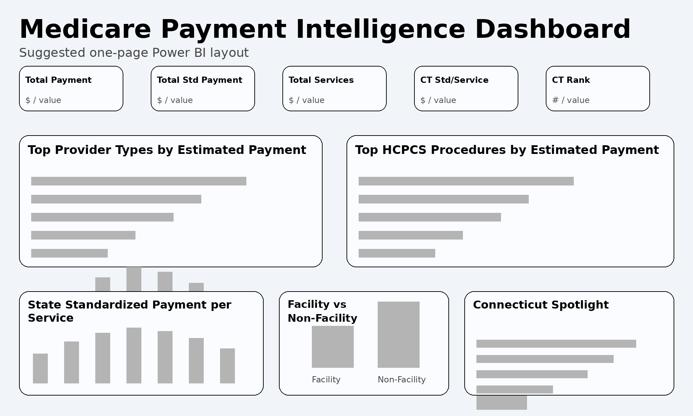
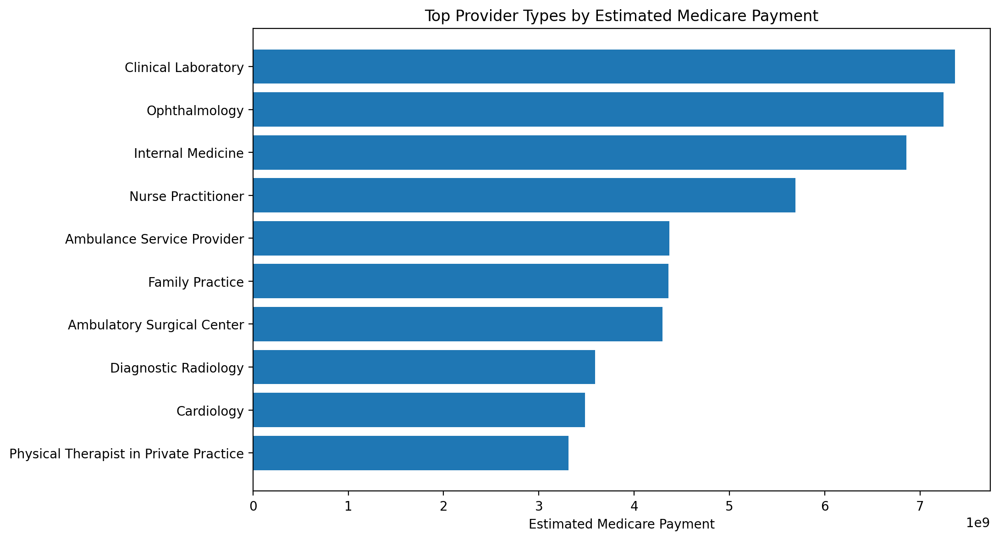
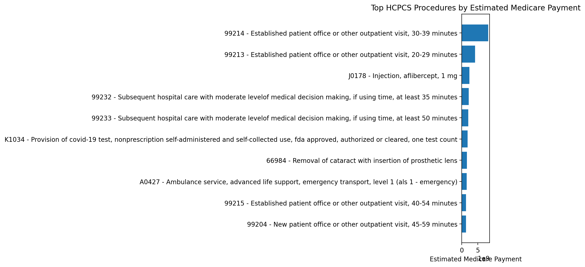
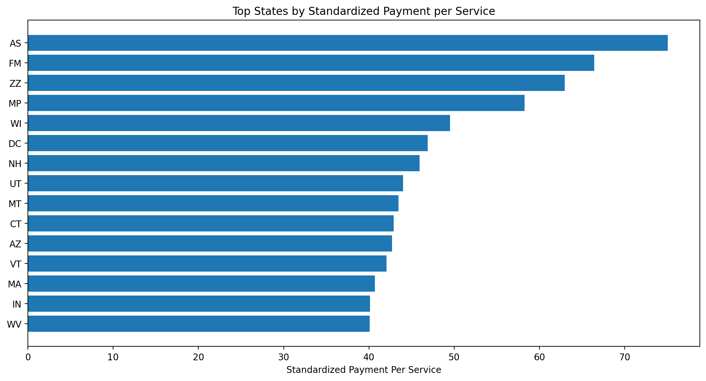
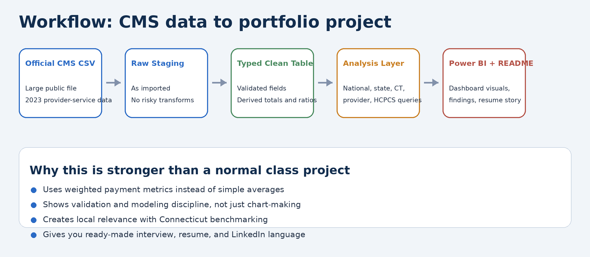
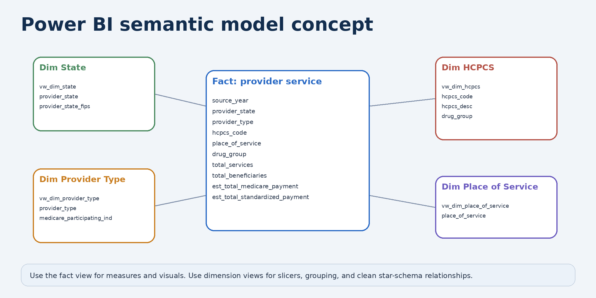

# Medicare Provider Service Analytics

Healthcare analytics portfolio project using the official CMS Medicare Physician & Other Practitioners by Provider and Service dataset.

This project analyzes Medicare provider-service payment patterns using Python, Pandas, DuckDB SQL, and Power BI-ready outputs. The goal is to identify payment drivers, high-volume provider types, top HCPCS service codes, state-level standardized payment differences, and Connecticut vs. national benchmarks.

---

## At a Glance

| Category | Detail |
|---|---|
| Dataset | CMS Medicare Physician & Other Practitioners by Provider and Service, 2023 |
| Records analyzed | 9,660,581 clean provider-service records |
| Distinct providers | 1,175,272 |
| States/territories | 62 |
| HCPCS service codes | 6,405 |
| Tools | Python, Pandas, DuckDB SQL, Power BI |
| Focus | Medicare payment drivers, HCPCS trends, provider types, Connecticut benchmarks |

---

## Project Highlights

- Analyzed 9,660,581 clean Medicare provider-service records.
- Included 1,175,272 distinct providers across 62 states/territories.
- Reviewed 6,405 HCPCS service codes.
- Estimated total Medicare payment was approximately $93.72B.
- Estimated standardized Medicare payment was approximately $92.81B.
- Connecticut standardized payment per service was $42.89, compared with the national average of $35.08.
- Connecticut ranked 10th by standardized payment per service.
- Connecticut was approximately 22.27% above the national standardized payment-per-service benchmark.
- Top provider type by Medicare payment: Clinical Laboratory, approximately $7.37B.
- Top HCPCS service by payment: 99214, established patient office/outpatient visit, approximately $8.23B.
- Connecticut’s top provider type by Medicare payment: Ophthalmology, approximately $84.62M.

---

## Insights

- Clinical Laboratory was the largest provider type by Medicare payment, showing that lab services were a major national payment driver in the 2023 provider-service file.
- HCPCS 99214 was the top service by payment, showing the importance of established patient office and outpatient visits in Medicare spending.
- Connecticut’s standardized payment per service was 22.27% above the national benchmark, suggesting a higher payment-per-service profile compared with the full dataset.
- Connecticut’s top provider type by payment was Ophthalmology, giving the project a state-level market analysis angle rather than only a national summary.
- The project connects raw public healthcare data to dashboard-ready outputs that can support payment benchmarking, provider mix review, and market-level analysis.

---

## Tools Used

- Python
- Pandas
- DuckDB SQL
- Power BI
- GitHub
- Official CMS public-use data

---

## Dashboard and Visual Outputs

This project includes Power BI-ready output files and generated chart assets for provider type, HCPCS service, state ranking, and Connecticut benchmark analysis.

### Dashboard Mockup



### Top Provider Types by Medicare Payment



### Top HCPCS Services by Medicare Payment



### State Standardized Payment Rankings



### Project Workflow



### Data Model / Schema Mockup



---

## Dataset

The project uses the official CMS Medicare Physician & Other Practitioners by Provider and Service public-use file:

`MUP_PHY_R25_P05_V20_D23_Prov_Svc.csv`

The raw CSV is not included in this repository because it is several gigabytes in size. To reproduce the analysis, download the official CMS 2023 CSV and place it locally in:

```text
data/raw/
